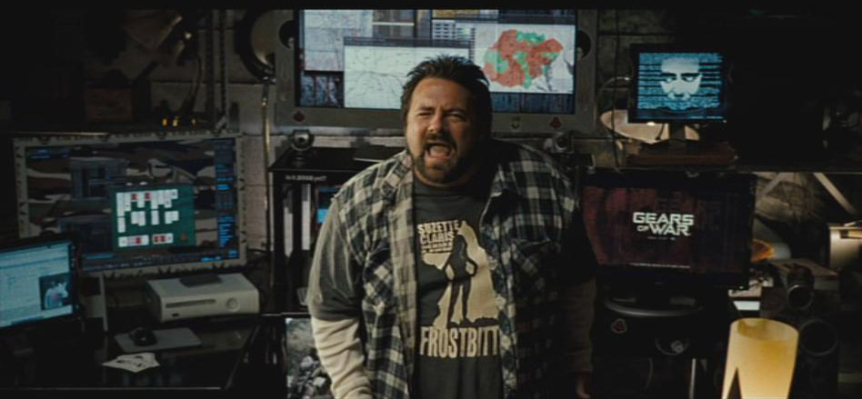

# flat-v-globe-nodejs

This is a `nodejs` app containing step by step observations used to test and demonstrate the shape of Earth. Each observation is contained within its own module folder and contains step by step instructions to follow along and replicate so **you** can prove the shape of Earth yourself from a location of your choosing.

I've made each module so simple to follow along I'm confident that even a flat Earther can manage without even leaving their Mum's basement. Sorry, their "command centre".

## List of modules

* `blue marbles` - Enter a date between 15/2/2015 and yesterday (today may work depending on your timezone) and get all the non-CGI non-composite photos showing Earth and it's curvature in its entirety, taken by EPIC on that date
* `calculate-local-sun-altitiude` - Configure the diameter for flat Earth, place markers and plot the Sun's path before seeing how a sunset would look on that flat Earth non-model. Tweak the values and see if you can find a viable flat Earth model
* `events-reporter` - Configure your location and see if there are any eclipses coming up. Verify these heliocentric based calculations with your own eyes (carefully) at the predicted time on the predicted date at the location you set
* `iss-locator` - Run the module and get the current coordinates of Earth's surface directly below the ISS. Use in conjunction with the alert to verify with your own eyes when it passes over your location
* `moon-phase-generator` - **INCOMPLETE** - Enter a location and get an image of the current Moon phase. Get an image for each hemisphere and see if this is what we would expect to see on a flat Earth or on a globe
* `planet-locator` - Configure an observation location, a date and time and run the module. It will return the location of the Sun, Moon, every planet in the Solar System, and Pluto. Verify the heliocentric based calculations for yourself using a compass, sextant and a telescope if necessary. Currently tested up to six months in advance with a 100% success rate.
* `shooting-stars` - Answering the question "Why don't we see shooting stars fall up?" while trying not to be too patronising (No code)
* `star-chart-generator` - **INCOMPLETE - Keep getting rate limited** Configure an observation location and either a constellation or an area of the night sky to receive a star chart for you to verify with your own eyes (and a telescope if you have one) 
* `sun-bearings` - **INCOMPLETE** Configure a few locations and an observation date. Receive with Sun bearings on the hour throughout the day for each location. Plot them on the map and see if they converge every time like they should on a flat Earth
* `tle` - **INCOMPLETE** Get two line element data for a selection of satellites. Verify with your own eyes when a satellite passes over your location

More coming soon

## Are you a flat Earther?

I mean a *real* one, not one of those people who just pretends on Twitter/X to believe it.

If so, try any observation here. Each one contains a markdown file with step by step instructions so you can let me know exactly which part of any observation you either disagree with, or are stuck on.

All of these observations can be configured to fit whatever diameter flat Earth you'd like to propose.

## How to download and install the app

1. Clone the repository
2. Open a terminal window at the root of the project
3. Run `yarn install` or `npm install` to install the required packages
4. Select a module to run and follow the instructions in the markdown file within the module folder

## Contact

If you're stuck, spot a mistake, have some better maths, or an idea for another API to connect to or module to build, feel free to let me know on Twitter/X at [@ElElCoolBey](https://twitter.com/elelcoolbey)
