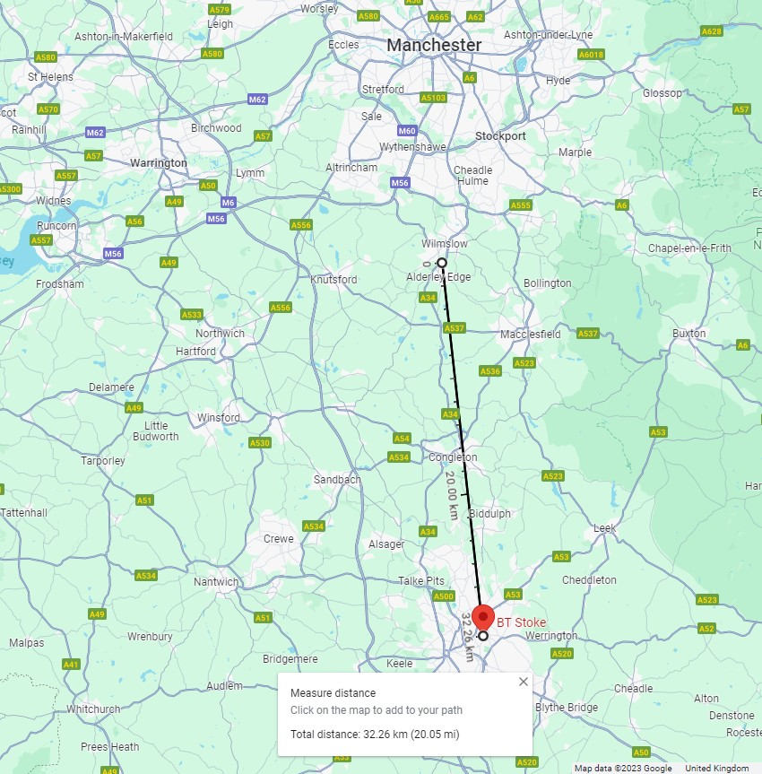

# Calculate the dome height

Difficulty: 1/5

Time required: 10-15 minutes

A very quick and easy way to demonstrate that a flat Earth with a local Sun and Moon under a dome is physically impossible.

This module is suitable for children aged 7+ who have a half decent grasp of maths, but they might need a hand with Photoshop

We will be drawing a 1:1 scale side on view of a flat Earth with a dome and local Sun, and then measuring some distances to see if flat Earth... holds water.

## Set up the document for a 1:1 scale

Open Photoshop or other pixel based drawing program and follow the numbered steps below (Allowing you to tell me exactly which step you're stuck on if you get stuck). 

This example uses a flat Earth with a diameter of 7,926 miles/pixels, and can be found in `img/flat-earth-tests.psd`. 

I have used this diameter as a starting point to match the diameter of Earth (the demonstrable globe), like a lot of flat Earthers try to until it gets analysed. 
This gives us an easy 1:1 scale, which should please flat Earthers no end, as we know they don't understand scale.
If you have a different diameter you want to use, update it in `config.js` and use that value as the pixel value to retain a 1:1 scale. All other calculations made here will also scale.

## Steps (with screenshots)

1. Draw a line 7,926 pixels long and place it in the centre of the circle to represent the flat Earth diameter as seen side on - As a starting point 

2. Create a circle with a diameter of 7,926 pixels and place it so it is central in relation to the flat Earth line. The flat Earth line should fill half the circle's thickness on each side.

The flat Earth line should fill half the circle's thickness on each side.

3. Place a marker at the bottom of the vertical line (North Pole marker)

4. Draw a line from the the North pole marker up to the top of the circle (The top of the dome)

It will be 3,963 pixels long, because the radius of a circle is half the diameter

5. Place a marker on the left of the flat Earth line and another on the right (Where the dome and ice wall meet at the outermost point of our cross section)

6. Place a marker centrally between the North Pole and each ice wall marker to represent the equator

7. Draw a line from the equator markers up at 90 degrees to where they meet the dome

They will be 3,405 pixels long

> We can now confidently say that a local Sun circling the equator above a flat Earth of this diameter with a demispherical dome cannot possibly fly above 3,405 miles above the surface
> We can try different shaped domes to test other claimed altitudes, if necessary, at the end of this test

8. Plot your position

Choosing either left or right (at this point it makes no difference), calculate the distance from your location to the North pole

* We know the equator is midway between the North pole and South pole/ice wall, so that distance is 3,963 miles. 

* We know that latitude (although heliocentric) works on 0-90 degrees North and 0-90 degrees South, with the Equator at 0 and the poles at 90

From that, we can take our latitude (53.31117° N) and use the following formula:

`(90 - the latitude of your location) / 90 x 3963`

This gives us an approximate distance to the North pole. In my case it would be 1,615.5 miles/pixels

> It's not going to be accurate to the metre, because Earth is not a perfect sphere. It has hills, valleys and mountains.
>
> Try this formula with distances you know. For example 10% of the distance will be 9 degrees. Half the distance will be 45 degrees, etc

Now we know the formula works we can place our location marker using our 1:1 scale

>An issue arises at this point, because on the globe, you can calculate this >distance using the same formula, but using the circumference of the globe >instead of the diameter:
>
>The circumference of Earth is 24,901 miles, but this would mean the distance >from the North pole to the South pole is 12,450.5 miles, which doesn't match >our flat Earth.
>
>This gives us a North pole to the equator distance of 6,225.25 miles.
>
>For Northerly latitudes: `(90 - the latitude of your location) / 90 x 6225.25`
>
>For Southerly latitudes: `(90 + the latitude of your location) / 90 x 6225.25`
>
> We can try this again with a 12,450.5 diameter flat Earth when we've finished this test

9. Place the Sun

According to the flat Earth society, the local Sun is either 3,000 miles up or 6,000 miles up, though they confuse "The altitude of the Sun above a flat Earth" with "distance to the Sun".

Obviously the observer's distance to the Sun would vary greatly depending on their location and the time of day, so to calculate distance to the Sun we simply use Pythagoras' Theorem for calculating the hypotenuse of a right angled triangle.

Our distance to the equator is `b`, the altitude of the Sun above the equator gives us `a`, and `distanceToTheSunAboveTheEquatorAtThatTime squared x Sun altitude squared` gives us the missing hypotenuse `c`; our distance to the Sun at any given time.

> Calculate this for sunrise, noon and sunset (module for that in development). Use the inverse square rule to determine whether the Sun should appear to get bigger of smaller throughout the day, and if so, by how much? Compare this with reality by taking photos of the Sun at these times (using the same focal length and camera settings)
>
> Does the Sun grow and shrink as much as it would on this flat Earth 'model', or does the 'model' fall apart?
>
> Come back to this after completing step 12 too, and see if the Sun is at the altitude a 3,000 mile high local Sun would be at for your location

We also see that the claim of a possible 6,000 miles does not fit, as this Sun would not be local.

> We can try again with a dome shaped like a bell jar when we've finished this test

For this first test we'll place the Sun at the 3,000 miles also claimed on that page

10. Draw a line from your location to the Sun's path above both equator markers

* As I've plotted my location on the left, the Sun at it's point furthest left is the Sun when it is due South of my position (Solar noon)

* It stands to reason that this means the Sun above the equator on the right of our 'model' is the Sun at its furthest point around midnight

11. Plot the tallest landmarks on that South line, and again on that "North and then South again on the other side" line

To my south is Stoke on Trent, where the tallest building is the Telecom building at a measly 138 ft, which equates to 0.026 pixels high, and it's located 20.05 miles away. As we can see this building is nowhere near tall enough to block the Sun on this 'model'

The tallest building to my North is Deansgate Square's South tower in Manchester (200.5 metres), located 11 miles away. It is 200.5 metres tall, which equates to 0.124 pixels high. Again, nowhere near tall enough to block the Sun

From this we know that there are no landmarks tall enough and close enough to block my view of the Sun to the North or to the South.

Taking this further, there are no built up areas or mountain ranges close enough in any direction to block the Sun

This means that on a flat Earth of these dimensions I would be able to see the Sun from my location all day and night, every day of the year.

12. It is usually at this point that flat Earthers claim the Sun is too far away at that point.

If this were true, it would have to be outside the dome, since we can see the stars that are supposed outside the dome, and we'd also still be able to see it with a telescope. Nobody has ever managed to.

Others claim the stars are within the dome or hung from it.

The distance to the top of the dome from my location is 4247.38 miles/pixels

My distance to the Sun at it's furthest is 4688.58 miles/pixels

My phone has 20x zoom, so I should be able to see the Sun from my location 24 hours a day, every day, only needing to use my phone to zoom in for a few hours at night. I have never been able to do this.

## Other predictable flat Earth responses

As expected with script based misinformation, flat Earthers haven't actually attempted to research any of their claims, so they can often be used against them.

Below is an ever increasing list of predictable responses, and why they're just as stupid as claiming Earth is flat

### The Sun's path actually extends to the tropics

We've already established that at the equator the Sun is far too high for sunset to work. Putting the Sun even higher still means it can be seen from anywhere 24/7 (which it can't) and can't dip below the horizon (which it does daily).

At the same time, we also see that if we're on a flat Earth, a local Sun would significantly change apparent size throughout the day, growing all morning as it gets so much closer, and then shrinking all afternoon until it appears tiny at night, visible only by zooming in with a phone, binoculars or telescope for a few hours, but always well above the horizon

Observations during any sunset:

* The Sun appears to be the same size it's been all day
* The Sun lowers past the horizon
* The Sun cannot be seen again from that location until sunrise

For the Sun to lower past the horizon, we can again look at Pythagoras' Theorem.

The line from the observer to the equator (or tropic) under the Sun is `b`, the Sun's altitude (3,000 miles) is `a`, and that makes the straight line from my location to the Sun `c`

The angle between `b` and `c` would have to become a negative number for the Sun to be below the horizon.

`b` would also have to be of sufficient length to extend past the ice wall, unless the Sun goes underground, which we know it doesn't.

This would put the Sun outside the dome too, which a local Sun can't be.

Yet more flat Earth fails

### Other suggested configurations

#### Flat Earth diameter 25,000 miles, sun altitude 6,000 miles

# Stuck? Found a discrepancy? Got a suggested module?

Let me know [on Twitter/X](https://twitter.com/elelcoolbey) which step you're on and what the issue is, though I'd be amazed if any flat Earthers make it this far.

