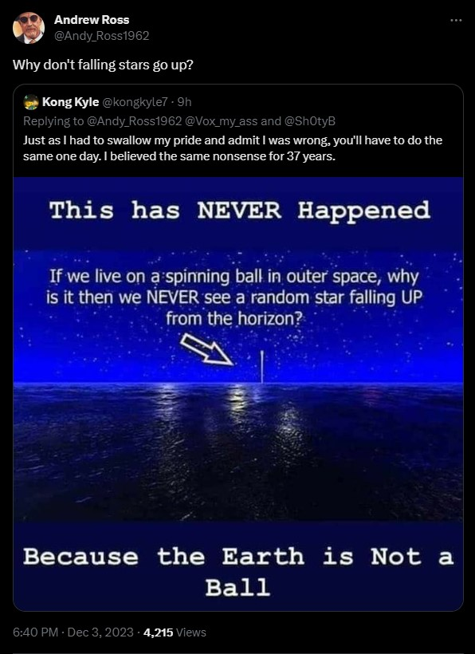
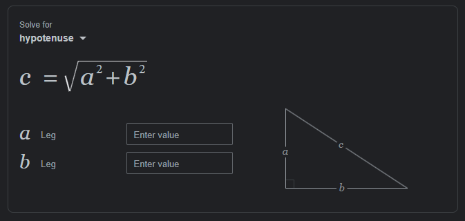
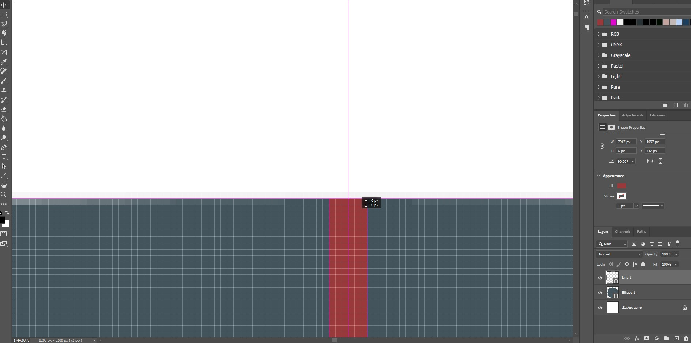
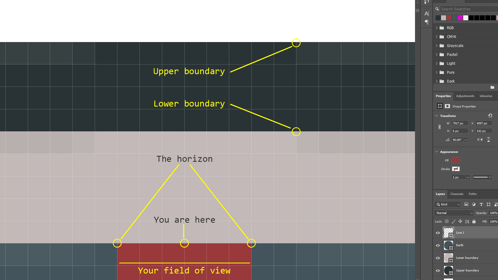
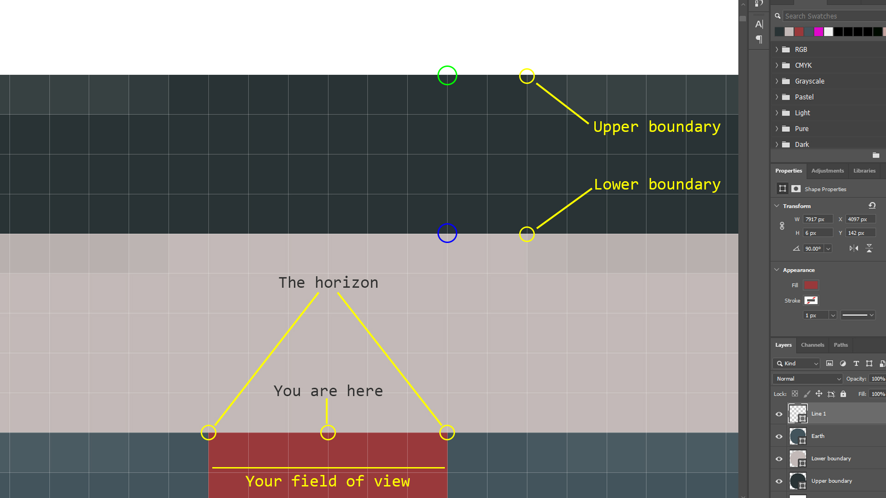

# Why don't we see shooting stars fall "up"?

> TLDR: Because Earth is way bigger than this ridiculous strawman implies.

The following steps are numbered and set out to be as simple as possible for anyone to follow along. If it comes across as patronising to you, I apologise, but it *was* written so that even flat Earthers wouldn't get stuck, and that if any of what I say is wrong, you can state exactly which step is wrong, and demonstrate why.

According to the heliocentric model...

1. The horizon is about 2.8 miles away
   
2. A shooting star is a meteor burning up as it passes through the Earth's atmosphere
   
3. The upper boundary of Earth's atmosphere is five to nine miles above the surface
   
4. A meteorite passing through Earth's atmosphere will hit the upper boundary before it hits the lower boundary
   
5. This gives us two right angled triangles that we can use to get the distance to the shooting star at each point in order to plot its trajectory
    * `a` is the distance from the surface to each point in the atmosphere
    * `b` is the distance from the observer to the horizon
    * `c` is the distance from the observer to the meteorite at each point

> Obviously by the time the average flat Earther has even attempted to calculate this distance and see if the resulting trajectory would appear to be up or down for the observer, mankind has started using flying pigs to fly high enough to see the curve with their own eyes, so I'll do it.

6. Calculate the upper boundary

    6.1 `a` squared is 81 (9 x 9)

    6.2 `b` squared is 7.84 (2.8 x 2.8)

    6.3 81 + 7.84 = 88.84

    6.4 The square root of 88.84 is 9.43

    6.5 That gives us a distance of `9.43` miles

7. Calculate the lower boundary

    7.1 `a` squared is 25 (5 x 5)

    7.2 `b` squared is 7.84 (2.8 x 2.8)

    7.3 25 + 7.84 = 32.84

    7.4 The square root of 32.84 is 5.73

    7.5 That gives us a distance of `5.73` miles 

8. Plot it

> I'm using a 1:1 scale diagram so I don't have to faff around converting the scale. It would only confuse the flat Earthers further. The PSD is located in `img/shooting-stars-test.psd`

8.1 Create a canvas big enough for a circle 7,917 pixels by 7,917 pixels to represent a cross section of a globe that has a diameter of 7,917 miles, giving us a 1:1 scale representation. Each pixel is one square mile.

8.2 Create that circle and centre it on the canvas

8.3 Create a circle 7,927 pixels by 7,927 pixels and centre it on the canvas. This is the lower boundary. 

8.4 Create a circle 7,935 pixels by 7,935 pixels and centre it on the canvas. This is the upper boundary. 

8.5 Create a vertical line 6 pixels thick by 7,917 pixels long, and centre it in the canvas

> 6 pixels is for our field of view, the (up to) 2.8 miles we can see in all directions direction from sea level, with out observation point being the intersection of the two sets of three pixels.

8.4 Zoom in as far as you can on the top middle of the circle

> Ooooops. this globe looks flat when you only look from horizon to horizon from the surface. And look how the pixels get some transparency a couple of miles past that as the curve of the circle comes into play. What a shocker.
>
> The lower boundary should fill 5 pixels above the surface of our globe layer. The same goes for the left, right and bottom of the circle.
>
> The upper boundary should be 4 pixels above the top of the lower boundary, giving a total of 9 pixels above the surface of our globe layer. The same goes for the left, right and bottom of the circle.

8.5 Take a screenshot like this so each square mile is cearly visible, but the image is now big enough to add more text and overlay info

8.6 From the centre of the field of view line, count along 3 pixels and up 9 pixels

8.7 Place a green circle at the upper boundary

8.8 From the centre of the field of view line, count along 3 pixels and up 5 pixels

8.9 Place a blue circle at the lower boundary

8.10 Your image should look like this

9. Analyse it

The meteor travelled from the green circle to the blue circle. Is that up or down from the observation point?